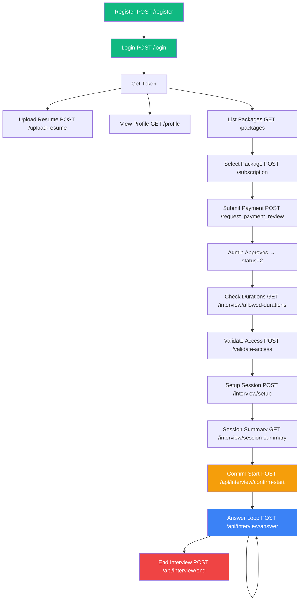

# 🚀 InterviewAI — Complete API Guide

> **Base URL**: `http://localhost:8000` (local) or your deployed Render URL  
> **Auth**: Most endpoints require `Authorization: Bearer <token>` header

---

## 🔐 PHASE 1: Authentication

### 1. Register — `POST /register`

**What it does**: Creates a new user account + gives 1 free interview credit.

```bash
curl -X POST http://localhost:8000/register \
  -H "Content-Type: application/json" \
  -d '{
    "username": "john_doe",
    "name": "John Doe",
    "email": "john@example.com",
    "phone": "+917505965253",
    "password": "Pass1234",
    "confirm_password": "Pass1234"
  }'
```

**✅ Success Response (201)**:
```json
{
  "id": 1,
  "username": "john_doe",
  "name": "John Doe",
  "email": "john@example.com",
  "phone": "+917505965253",
  "pic": null,
  "is_valid": 1,
  "interview_limit": 1,
  "tier": "free"
}
```

**❌ Error (400)**: `"Username already taken"` or `"Passwords do not match"`

> [!NOTE]
> Validation rules: Username max 30 chars (alphanumeric + underscore), Password 8-13 chars with at least 1 letter and 1 digit.

---

### 2. Login — `POST /login`

**What it does**: Authenticates user and returns a JWT Bearer token.

```bash
curl -X POST http://localhost:8000/login \
  -H "Content-Type: application/json" \
  -d '{
    "username": "john_doe",
    "password": "Pass1234"
  }'
```

**✅ Success Response (200)**:
```json
{
  "access_token": "eyJhbGciOiJIUzI1NiIsInR5cCI6IkpXVCJ9...",
  "token_type": "bearer"
}
```

> [!IMPORTANT]
> Save this `access_token` — you'll pass it as `Authorization: Bearer <token>` in ALL subsequent requests.

---

### 3. Logout — `POST /logout`

**What it does**: Blacklists the current token so it can't be reused.

```bash
curl -X POST http://localhost:8000/logout \
  -H "Authorization: Bearer eyJhbGciOi..."
```

**✅ Response**: `{"message": "Successfully logged out"}`

---

### 4. Get Current User — `GET /me`

**What it does**: Returns the logged-in user's profile info.

```bash
curl http://localhost:8000/me \
  -H "Authorization: Bearer eyJhbGciOi..."
```

**✅ Response**: Same shape as the register response.

---

## 📄 PHASE 2: Resume Management

### 5. Upload Resume — `POST /upload-resume`

**What it does**: Uploads a PDF, parses it (extracts skills, sections, photo), stores in DB.

```bash
curl -X POST http://localhost:8000/upload-resume \
  -H "Authorization: Bearer eyJhbGciOi..." \
  -F "file=@/path/to/resume.pdf"
```

**✅ Response**:
```json
{
  "success": true,
  "message": "Resume uploaded and parsed successfully",
  "data": {
    "resume_id": 1,
    "resume_name": "resume.pdf",
    "size": "256 KB",
    "updated_at": "May 15, 2026",
    "skills": ["Python", "React", "SQL"],
    "domain": "Software Engineering",
    "view_resume": "/resume/1/view",
    "download_resume": "/resume/1/download",
    "delete_resume": "/resume/1"
  }
}
```

> [!NOTE]
> Only PDF files ≤ 5MB are accepted. Old resumes are auto-deleted (1 resume per user policy).

---

### 6. List Resumes — `GET /resumes`

**What it does**: Returns all resumes uploaded by the current user.

```bash
curl http://localhost:8000/resumes \
  -H "Authorization: Bearer eyJhbGciOi..."
```

---

### 7. View Resume — `GET /resume/{resume_id}/view`

**What it does**: Opens the PDF inline in the browser.

```bash
curl http://localhost:8000/resume/1/view \
  -H "Authorization: Bearer eyJhbGciOi..."
```

---

### 8. Download Resume — `GET /resume/{resume_id}/download`

**What it does**: Downloads the PDF as an attachment.

```bash
curl -o resume.pdf http://localhost:8000/resume/1/download \
  -H "Authorization: Bearer eyJhbGciOi..."
```

---

### 9. Delete Resume — `DELETE /resume/{resume_id}`

**What it does**: Deletes the resume from DB and disk.

```bash
curl -X DELETE http://localhost:8000/resume/1 \
  -H "Authorization: Bearer eyJhbGciOi..."
```

**✅ Response**: `{"success": true, "message": "Resume 'resume.pdf' deleted successfully"}`

---

## 👤 PHASE 3: Profile Management

### 10. Get Profile — `GET /profile`

**What it does**: Returns user info + all parsed resume sections (skills, education, experience, etc.)

```bash
curl http://localhost:8000/profile \
  -H "Authorization: Bearer eyJhbGciOi..."
```

**✅ Response**:
```json
{
  "user_id": 1,
  "username": "john_doe",
  "name": "John Doe",
  "email": "john@example.com",
  "resume_path": "/uploads/resumes/1/abc123_resume.pdf",
  "user_image": "https://res.cloudinary.com/...",
  "profile": [
    {"attribute_code": "technical_skills", "attribute_name": "Technical Skills", "value": "Python, React, SQL"},
    {"attribute_code": "education", "attribute_name": "Education", "value": "B.Tech CSE, IIT Delhi"}
  ]
}
```

---

### 11. Update Profile Field — `PUT /profile`

**What it does**: Updates a specific resume section by its attribute code.

```bash
curl -X PUT http://localhost:8000/profile \
  -H "Authorization: Bearer eyJhbGciOi..." \
  -H "Content-Type: application/json" \
  -d '{
    "attribute_code": "technical_skills",
    "value": "Python, React, SQL, Docker, AWS"
  }'
```

---

### 12. Update User Info — `PUT /update-profile`

**What it does**: Updates name, email, phone (user table fields, NOT resume sections).

```bash
curl -X PUT http://localhost:8000/update-profile \
  -H "Authorization: Bearer eyJhbGciOi..." \
  -H "Content-Type: application/json" \
  -d '{
    "first_name": "Adarsh",
    "last_name": "Tiwari",
    "email": "newemail@gmail.com",
    "phone": "7505965253"
  }'
```

---

### 13. Upload Profile Image — `PUT /update-profile/image`

**What it does**: Uploads an avatar image to Cloudinary and saves the URL.

```bash
curl -X PUT http://localhost:8000/update-profile/image \
  -H "Authorization: Bearer eyJhbGciOi..." \
  -F "profile_image=@/path/to/photo.jpg"
```

**✅ Response**: `{"success": true, "message": "Profile image uploaded successfully", "user_image": "https://res.cloudinary.com/..."}`

> [!NOTE]
> Accepts JPEG, PNG, GIF, WebP — max 2MB.

---

### 14. List Attributes — `GET /attributes`

**What it does**: Lists all available resume section types (skills, education, etc.)

```bash
curl http://localhost:8000/attributes \
  -H "Authorization: Bearer eyJhbGciOi..."
```

---

### 15. Change Password — `POST /change-password`

```bash
curl -X POST http://localhost:8000/change-password \
  -H "Authorization: Bearer eyJhbGciOi..." \
  -H "Content-Type: application/json" \
  -d '{
    "old_password": "Pass1234",
    "new_password": "NewPass99",
    "confirm_password": "NewPass99"
  }'
```

---

### 16. Delete Account — `DELETE /user`

**What it does**: Permanently deletes the user and ALL their data.

```bash
curl -X DELETE http://localhost:8000/user \
  -H "Authorization: Bearer eyJhbGciOi..."
```

---

## 💳 PHASE 4: Subscriptions & Payments

### 17. List Packages — `GET /packages`

**What it does**: Returns all available subscription plans (Basic, Pro, Premium).

```bash
curl http://localhost:8000/packages
```

**✅ Response**:
```json
[
  {"id": 1, "name": "Basic Plan", "price": 0.0, "interview_limit": 1, "features": "1 free interview"},
  {"id": 2, "name": "Pro Plan", "price": 499.0, "interview_limit": 10, "features": "10 interviews, AI reports"},
  {"id": 3, "name": "Premium Plan", "price": 999.0, "interview_limit": 30, "features": "30 interviews, priority"}
]
```

---

### 18. Create Subscription — `POST /subscription`

**What it does**: User selects a package → creates a pending subscription (status=0).

```bash
curl -X POST http://localhost:8000/subscription \
  -H "Authorization: Bearer eyJhbGciOi..." \
  -H "Content-Type: application/json" \
  -d '{"package_id": 2}'
```

**✅ Response** (status meanings: `0`=Pending, `1`=Requested, `2`=Active):
```json
{
  "id": 5,
  "package_id": 2,
  "package_name": "Pro Plan",
  "interview_limit": 10,
  "pricing": 499.0,
  "start_date": "2026-05-15T12:00:00",
  "end_date": "2026-06-14T12:00:00",
  "status": 0
}
```

---

### 19. Get Subscriptions — `GET /subscriptions`

**What it does**: Returns ALL subscription history for the user.

```bash
curl http://localhost:8000/subscriptions \
  -H "Authorization: Bearer eyJhbGciOi..."
```

---

### 20. Get Active Subscription — `GET /subscription`

**What it does**: Returns the latest subscription. Falls back to "Free" if none exists.

```bash
curl http://localhost:8000/subscription \
  -H "Authorization: Bearer eyJhbGciOi..."
```

---

### 21. Request Payment Review — `POST /request_payment_review`

**What it does**: User submits payment proof → creates payment record, updates subscription to "requested" (status=1).

```bash
curl -X POST http://localhost:8000/request_payment_review \
  -H "Authorization: Bearer eyJhbGciOi..." \
  -H "Content-Type: application/json" \
  -d '{
    "subscription_id": 5,
    "payment_method": "UPI",
    "transaction_id": "TXN123456789",
    "amount_paid": 499.0,
    "note": "Paid via Google Pay"
  }'
```

---

### 22. Payment History — `GET /payments`

```bash
curl http://localhost:8000/payments \
  -H "Authorization: Bearer eyJhbGciOi..."
```

---

## 🎯 PHASE 5: Interview Flow

> [!IMPORTANT]
> This is the core interview pipeline. The flow is:
> **Validate Access → Setup Session → Session Summary → Confirm Start → Answer Loop → End Interview**

### 23. Get Allowed Durations — `GET /interview/allowed-durations`

**What it does**: Shows which interview durations (10/20/40 min) the user can afford with their credits.

```bash
curl http://localhost:8000/interview/allowed-durations \
  -H "Authorization: Bearer eyJhbGciOi..."
```

**✅ Response**:
```json
{
  "userid": 1,
  "credits_remaining": 5,
  "allowed_durations": [
    {"duration": 10, "is_available": true, "cost": 1, "unavailable_reason": null},
    {"duration": 20, "is_available": true, "cost": 2, "unavailable_reason": null},
    {"duration": 40, "is_available": true, "cost": 4, "unavailable_reason": null}
  ],
  "upgrade_banner": {"show": false, "message": "", "target_plan": ""}
}
```

---

### 24. Validate Access — `POST /validate-access`

**What it does**: Checks if user has enough credits for the selected duration BEFORE creating a session.

```bash
curl -X POST http://localhost:8000/validate-access \
  -H "Authorization: Bearer eyJhbGciOi..." \
  -H "Content-Type: application/json" \
  -d '{
    "duration_minutes": 20,
    "role": "Backend Developer",
    "topic": "System Design",
    "difficulty": "medium"
  }'
```

**✅ Allowed**:
```json
{
  "allowed": true,
  "credits_remaining": 5,
  "cost_required": 2,
  "credits_after": 3,
  "warning": null,
  "max_duration_allowed": 40
}
```

**❌ Blocked**:
```json
{
  "allowed": false,
  "credits_remaining": 0,
  "reason": "You have no credits left. Please purchase a plan to continue.",
  "upgrade_required": true,
  "redirect_to": "/plans"
}
```

---

### 25. Setup Interview — `POST /interview/setup`

**What it does**: Creates an interview session, deducts credits, links the resume, calculates question count.

```bash
curl -X POST http://localhost:8000/interview/setup \
  -H "Authorization: Bearer eyJhbGciOi..." \
  -H "Content-Type: application/json" \
  -d '{
    "role": "Backend Developer",
    "topic": "System Design",
    "difficulty": "medium",
    "duration_minutes": 20
  }'
```

**✅ Response**:
```json
{
  "success": true,
  "session_id": 42,
  "userid": 1,
  "name": "John Doe",
  "role": "Backend Developer",
  "topic": "System Design",
  "difficulty": "medium",
  "duration_minutes": 20,
  "total_questions": 10,
  "resume_id": 1,
  "has_resume": true,
  "status": "active",
  "credits_remaining": 3,
  "credits_used": 2,
  "credits_deducted": 2
}
```

> Duration → Questions mapping: `10min=5`, `20min=10`, `40min=20`

---

### 26. Cancel Setup (Refund) — `POST /interview/change-setup`

**What it does**: Cancels a session that hasn't started yet, refunds credits.

```bash
curl -X POST http://localhost:8000/interview/change-setup \
  -H "Authorization: Bearer eyJhbGciOi..." \
  -H "Content-Type: application/json" \
  -d '{"session_id": 42}'
```

**✅ Response**:
```json
{
  "success": true,
  "message": "Session setup cancelled and credits refunded.",
  "session_id": 42,
  "credits_refunded": 2,
  "credits_remaining": 5
}
```

---

### 27. Session Summary — `GET /interview/session-summary`

**What it does**: Powers the "Ready to begin?" confirmation screen.

```bash
curl "http://localhost:8000/interview/session-summary?session_id=42&userid=1" \
  -H "Authorization: Bearer eyJhbGciOi..."
```

**✅ Response**:
```json
{
  "success": true,
  "session_id": 42,
  "userid": 1,
  "role": "Backend Developer",
  "topic": "System Design",
  "difficulty": "medium",
  "duration_minutes": 20,
  "total_questions": 10,
  "has_resume": true,
  "credits_remaining": 3,
  "status": "active",
  "info_message": "The AI interviewer will greet you and begin asking questions..."
}
```

---

### 28. Confirm Start — `POST /api/interview/confirm-start`

**What it does**: Marks `started_at`, fetches questions from DB, generates AI greeting.

```bash
curl -X POST http://localhost:8000/api/interview/confirm-start \
  -H "Authorization: Bearer eyJhbGciOi..." \
  -H "Content-Type: application/json" \
  -d '{"session_id": 42, "userid": 1}'
```

**✅ Response**:
```json
{
  "success": true,
  "questions_list": [
    "Explain the difference between SQL and NoSQL databases.",
    "How would you design a URL shortener?",
    "..."
  ],
  "ai_greeting": "Hello John Doe! I am your AI interviewer for today...",
  "conversation_history": [
    {"role": "system", "content": "You are an expert AI interviewer..."},
    {"role": "assistant", "content": "Hello John Doe!..."}
  ]
}
```

---

### 29. Submit Answer — `POST /api/interview/answer`

**What it does**: Sends user's answer to GPT-4o, gets AI evaluation + next question.

```bash
curl -X POST http://localhost:8000/api/interview/answer \
  -H "Authorization: Bearer eyJhbGciOi..." \
  -H "Content-Type: application/json" \
  -d '{
    "session_id": 42,
    "userid": 1,
    "answer": "SQL databases are relational and use structured schemas...",
    "question_number": 1,
    "is_skipped": false,
    "conversation_history": [
      {"role": "system", "content": "You are an expert AI interviewer..."},
      {"role": "assistant", "content": "Hello John Doe!..."}
    ]
  }'
```

**✅ Response**:
```json
{
  "next_ai_message": "Good explanation! Now, how would you design a rate limiter for an API?",
  "conversation_history": ["... updated history ..."],
  "question_number": 2,
  "interview_complete": false
}
```

> Set `"is_skipped": true` to skip a question.

---

### 30. End Interview — `POST /api/interview/end`

**What it does**: Marks the session as `ended`, records `ended_at` timestamp.

```bash
curl -X POST http://localhost:8000/api/interview/end \
  -H "Authorization: Bearer eyJhbGciOi..." \
  -H "Content-Type: application/json" \
  -d '{
    "session_id": 42,
    "userid": 1,
    "conversation_history": []
  }'
```

**✅ Response**: `{"success": true, "message": "Interview completed successfully."}`

---

## 🛠️ PHASE 6: Admin & Utility

### 31. Seed Questions — `POST /admin/questions/seed`

**What it does**: Uses GPT-4o to generate 60 interview questions across 6 roles and inserts them into the DB.

```bash
curl -X POST http://localhost:8000/admin/questions/seed
```

**✅ Response**: `{"success": true, "total_inserted": 60, "message": "Questions seeded successfully"}`

> [!WARNING]
> This endpoint has no auth protection — it's admin-only. Don't expose in production without adding auth.

---

### 32. Get Interview Roles — `GET /interview/roles`

**What it does**: Returns all distinct roles available in the Questions table.

```bash
curl http://localhost:8000/interview/roles
```

**✅ Response**:
```json
{
  "success": true,
  "roles": ["Backend Developer", "Data Analyst", "Frontend Developer", "Full Stack Developer", "HR Manager", "Marketing Analyst", "Other"]
}
```

---

## 📊 Complete Flow Diagram



---

## 🔑 Quick Reference: Status Codes

| Entity | Status | Meaning |
|--------|--------|---------|
| **Subscription** | `0` | Pending (just selected) |
| **Subscription** | `1` | Payment Requested |
| **Subscription** | `2` | Active (admin approved) |
| **Session** | `active` | Created, not yet started |
| **Session** | `ended` | Interview completed |
| **Session** | `abandoned` | Cancelled before starting |
| **Payment** | `pending` | Awaiting admin review |

---

## ⚡ Testing Tip

Visit **`http://localhost:8000/docs`** for the auto-generated Swagger UI where you can test all endpoints interactively!
